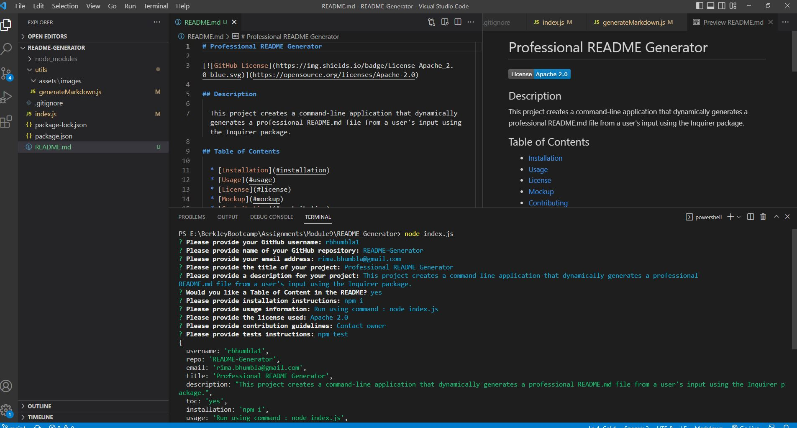

# README-Generator
Repository for a command-line application that dynamically generates a professional README.md file from a user's input using the Inquirer package.

## Description
README Generator is a comand line Node.js program that will generate a README file based on professional README guidelines and user input.  Here are the features of this program:

1. On the terminal command line, run the application using theocmmand "node index.js".  This will ask a series of question fro the user to pupolate the README file.
2. The user is prompted for the followinginformation: 
    * User's github username
    * User's project repository
    * User's email
    * Title of the project
    * Description of the project
    * Table of Content wanted or not in README.  Default is 'yes'.
    * Installation Instructions.  Default is 'npm i'.
    * Usage information
    * License used.  A list of GitHub licenses is provided to choose from includng a None option
    * Contribution guideline and
    * Tests instructions. Detfaulted is 'npm test'
3. A high-quality, professional README.md is generated with the title of project and sections entitled Description, Table of Contents(if user wanted), Installation, Usage, License, Contributing, Tests, and Questions
4. A badge for that license is added near the top of the README and a notice is added to the section of the README entitled License that explains which license the application is covered under.
5. The section of the README entitled Questions contains the with a link to my GitHub profile from the username provided and 
the user's email address with instructions on how to reach them with additional questions
6. When the links in the Table of Contents, we are taken to the corresponding section of the README

## Mock Up

Demo of the project:./assets/images/README-Generator.mp4 or https://drive.google.com/drive/u/0/folders/18mO2uMToFZH8J3mHR10bD3oF-PrAZ99h

Sample README.md generated: ./README_Sample.md

## Usage
1. You can access the file in GitHub repository: https://github.com/rbhumbla1/README-Generator
2. Run the application in the terminal using this command:node index.js

## License
None
